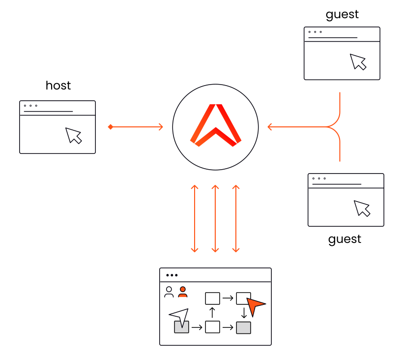

# Ably Labs Template Repo

## Description

Ably innovation day project to produce a POC that uses Ably network as a VIM livecode transport

VIM is a text editor with a particular user base. The program has been around for a long time and people who use VIM love it. On the VIM.org website it is interesting to note that the [vote results](https://www.vim.org/sponsor/vote_results.php) places collaborative editing as one of the highest ranked requests.

> No. 6 - add collaborative editing: changes made to a buffer show up in another Vim in a second

There are a number of VIM plugin implementations that address collaboration on a shared buffer, and this project draws from that inspiration. Of the plugins we looked at during the hackathon they, independent of the language, have a common denominator. They all reach for a websocket server as the vechile to transport the messages.

However there is a drawback by using that method. The Web socket server needs to run in some DMZ on the internet, or via proxy service like nGrok, which exposes a local-host server on the internet. This is required because that is how the collaborators connect each other.

Since we all work at Ably we know that using our network mitigates this necessity. The Ably Realtime network is already a public infrastructure. In addition to this we wanted to use the light weight MQTT protocol to function as the message carrier.

## Building & running locally

- First you need to add `ABLY_API_KEY_LIVECODE` to your environment, to get a key [sign up for FREE account](https://ably.com/sign-up)

### Prerequisites

1. [Sign up](https://ably.com/signup) or [log in](https://ably.com/login) to ably.com, and [create a new app and copy the API key](https://faqs.ably.com/setting-up-and-managing-api-keys).
2. Install X
3. Install Y

### Building the project

// Add step by step instructions for building & running locally.

## Deploying to the cloud

// Add step by step instructions for deployment. Refer to the GitHub workflow where possible.

## Contributing

We have a [contributing guide](CONTRIBUTING.md) that explains how to contribute to this repository.

## More info

// Add links to related blog, video, personal twitter handle.

- [Ably on Twitter](https://twitter.com/ablyrealtime)
- [Ably SDKs](https://github.com/ably/)
- [Ably.com](https://ably.com)
- [Sign up for FREE account](https://ably.com/sign-up)

